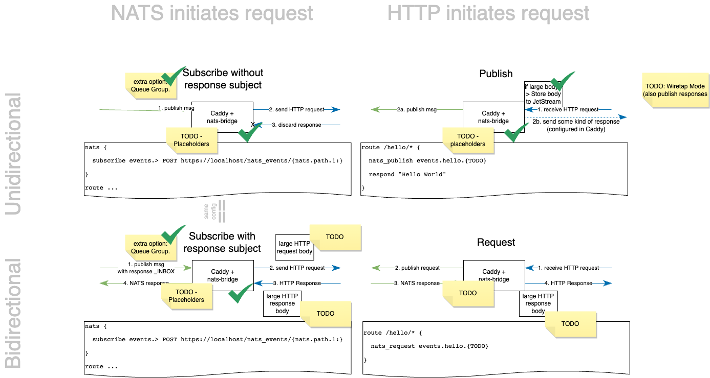

# Caddy-NATS

`caddy-nats` is a caddy module that allows the caddy server to interact with a
[NATS](https://nats.io/) server. This extension supports multiple patterns:
publish/subscribe, fan in/out, and request reply.

The purpose of this project is to better bridge HTTP based services with NATS
in a pragmatic and straightforward way. If you've been wanting to use NATS, but
have some use cases that still need to use HTTP, this may be a really good
option for you.

## Installation

To use `caddy-nats`, simply run the [xcaddy](https://github.com/caddyserver/xcaddy) build tool to create a `caddy-nats` compatible caddy server.

```sh
xcaddy build --with github.com/codegangsta/caddy-nats
```

## Getting Started

Getting up and running with `caddy-nats` is pretty simple:

First [install NATS](https://docs.nats.io/running-a-nats-service/introduction/installation) and make sure the NATS server is running:

```sh
nats-server
```


Then create your Caddyfile:

```nginx
{
  nats {
    reply hello GET https://localhost/hello
  }
}

localhost {
  route /hello {
    respond "Hello, world"
  }
}
```

After running your custom built `caddy` server with this Caddyfile, you can
then run the `nats` cli tool to test it out:

```sh
nats req hello ""
```

## Connecting to NATS

To connect to `nats`, simply use the `nats` global option in your Caddyfile with the URL of the NATS server:

```nginx
{
  nats [alias] {
    url nats://127.0.0.1:4222
  } 
}
```

The `alias` is a server-reference which is relevant if you want to connect to two NATS servers at the same time.
It is 

On top, the following options are supported:

```nginx
{
  nats [alias] {
    url nats://127.0.0.1:4222
    # either userCredentialFile or nkeyCredentialFile can be specified. If both are specified, userCredentialFile
    # takes precedence.
    userCredentialFile /path/to/file.creds
    nkeyCredentialFile /path/to/file.nk
    clientName MyClient
    inboxPrefix _INBOX_custom
  }
}
```

## Connectivity Modes



TODO EXPLAIN

## Subscribing to a NATS subject

`caddy-nats` supports subscribing to NATS subjects in a few different flavors,
depending on your needs.

### Subscribe Placeholders

All `subscribe` based directives (`subscribe`, `reply`, `queue_subscribe`, `queue_reply`) support the following `caddy` placeholders in the `method` and `url` arguments:

- `{nats.path}`: The subject of this message, with dots "." replaced with a slash "/" to make it easy to map to a URL.
- `{nats.path.*}`: You can also select a segment of a path ex: `{nats.path.0}` or a subslice of a path: `{nats.path.2:}` or `{nats.path.2:7}` to have ultimate flexibility in what to forward onto the URL path.

---

### subscribe

#### Syntax
```nginx
subscribe <subject> <method> <url>
```

`subscribe` will subscribe to the specific NATS subject (wildcards are
supported) and forward the NATS payload to the specified URL inside the caddy
web server. This directive does not care about the HTTP response, and is
generally fire and forget.

#### Example

Subscribe to an event stream in NATS and call an HTTP endpoint:

```nginx
{
  nats {
      subscribe events.> POST https://localhost/nats_events/{nats.path.1:}
  }
}
```

---

### reply

#### Syntax
```nginx
reply <subject> <method> <url>
```

`reply` will subscribe to the specific NATS subject and forward the NATS
payload to the specified URL inside the caddy web server. This directive will
then respond back to the nats message with the response body of the HTTP
request.

#### Example

Respond to the `hello.world` NATS subject with the response of the `/hello/world` endpoint.

```nginx
{
  nats {
    reply hello.world GET https://localhost/hello/world
  }
}
```

---

### queue_subscribe

#### Syntax
```nginx
queue_subscribe <subject> <queue> <method> <url>
```
`queue_subscribe` operates the same way as `subscribe`, but subscribes under a NATS [queue group](https://docs.nats.io/nats-concepts/core-nats/queue)

#### Example

Subscribe to a worker queue:

```nginx
{
  nats {
    queue_subscribe jobs.* workers_queue POST https://localhost/{nats.path}
  }
}
```

---

### queue_reply

#### Syntax
```nginx
queue_reply <subject> <queue> <method> <url>
```

`queue_reply` operates the same way as `reply`, but subscribes under a NATS [queue group](https://docs.nats.io/nats-concepts/core-nats/queue)

#### Example

Subscribe to a worker queue, and respond to the NATS message:

```nginx
{
  nats {
    queue_reply jobs.* workers_queue POST https://localhost/{nats.path}
  }
}
```

## Publishing to a NATS subject

`caddy-nats` also supports publishing to NATS subjects when an HTTP call is
matched within `caddy`, this makes for some very powerful bidirectional
patterns.

### Publish Placeholders

All `publish` based directives (`nats_publish`, `nats_request`) support the following `caddy` placeholders in the `subject` argument:

- `{nats.subject}`: The path of the http request, with slashes "/" replaced with dots "." to make it easy to map to a NATS subject.
- `{nats.subject.*}`: You can also select a segment of a subject ex: `{nats.subject.0}` or a subslice of the subject: `{nats.subject.2:}` or `{nats.subject.2:7}` to have ultimate flexibility in what to forward onto the URL path.

Additionally, since `publish` based directives are caddy http handlers, you also get access to all [caddy http placeholders](https://caddyserver.com/docs/modules/http#docs).

---

### nats_publish

#### Syntax
```nginx
nats_publish [<matcher>] <subject> {
  timeout <timeout-ms>
}
```
`nats_publish` publishes the request body to the specified NATS subject. This
http handler is not a terminal handler, which means it can be used as
middleware (Think logging and events for specific http requests).

#### Example

Publish an event before responding to the http request:

```nginx
localhost {
  route /hello {
    nats_publish events.hello
    respond "Hello, world"
  }
}
```

---

### nats_request

#### Syntax
```nginx
nats_request [<matcher>] <subject> {
  timeout <timeout-ms>
}
```
`nats_request` publishes the request body to the specified NATS subject, and
writes the response of the NATS reply to the http response body.

#### Example

Publish an event before responding to the http request:

```nginx
localhost {
  route /hello/* {
    nats_request hello_service.{nats.subject.1}
  }
}
```

#### Format of the NATS message

- HTTP Body = NATS Message Data
- HTTP Headers = NATS Message Headers
  - `X-Http-Method` header: contains the HTTP header `GET,POST,HEAD,...`
- NATS messages have a size limit of usually 1 MB (and 8 MB as hardcoded limit).
  In case the HTTP body is bigger, or alternatively, is submitted with `Transfer-Encoding: chunked` (so we do not know the size upfront);
  we do the following:
  - We store the HTTP body in the [JetStream Object Storage (EXPERIMENTAL)](https://docs.nats.io/using-nats/developer/develop_jetstream/object)
    for a few minutes; in a random key.
  - The name of this KV Storage key is stored in the `X-Large-Body-Id`.
    - TODO: support for response body re-use based on cache etags?


## Concept

- HTTP => NATS => HTTP should functionally emit the same requests (and responses)
- Big Request bodies should be stored to JetStream
  - for transfer encoding chunked
- (NATS -> HTTP) Big response bodies should be stored to JetStream
  - for transfer encoding chunked
  - for unknown response sizes
  - TODO: Re-use same cache entries if etags match?
- TODO: is request / response streaming necessary???
- All HTTP headers are passed through to NATS without modification
- All Nats headers except "X-NatsHttp-...." are passed to HTTP without modification
  - X-NatsHttp-Method
  - X-NatsHttp-JSBodyId
- allow multiple NATS servers

## What's Next?
While this is currently functional and useful as is, here are the things I'd like to add next:

- [ ] Add more examples in the /examples directory
- [ ] Add Validation for all caddy modules in this package
- [ ] Add godoc comments
- [ ] Support mapping nats headers and http headers for upstream and downstream
- [ ] Customizable error handling
- [ ] Jetstream support (for all that persistence babyyyy)
- [ ] nats KV for storage
